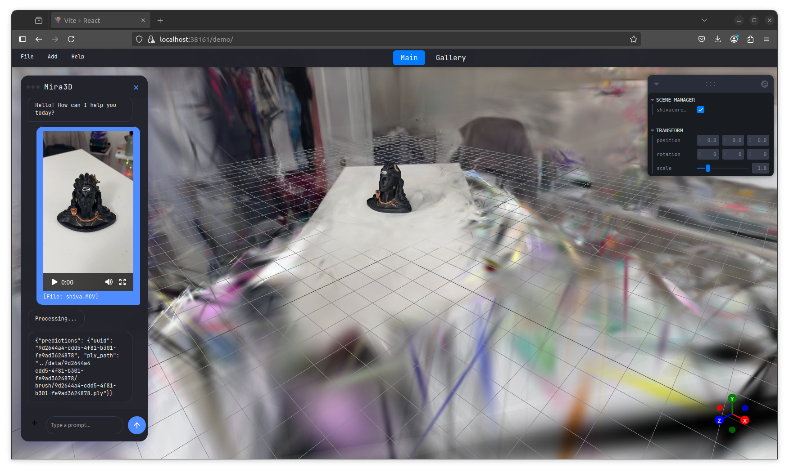
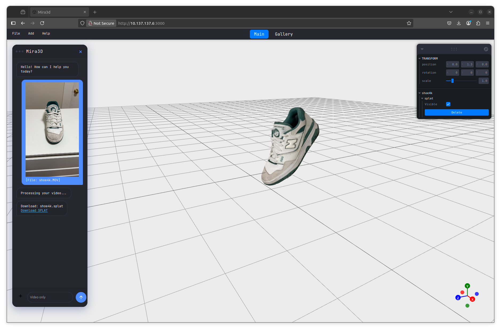
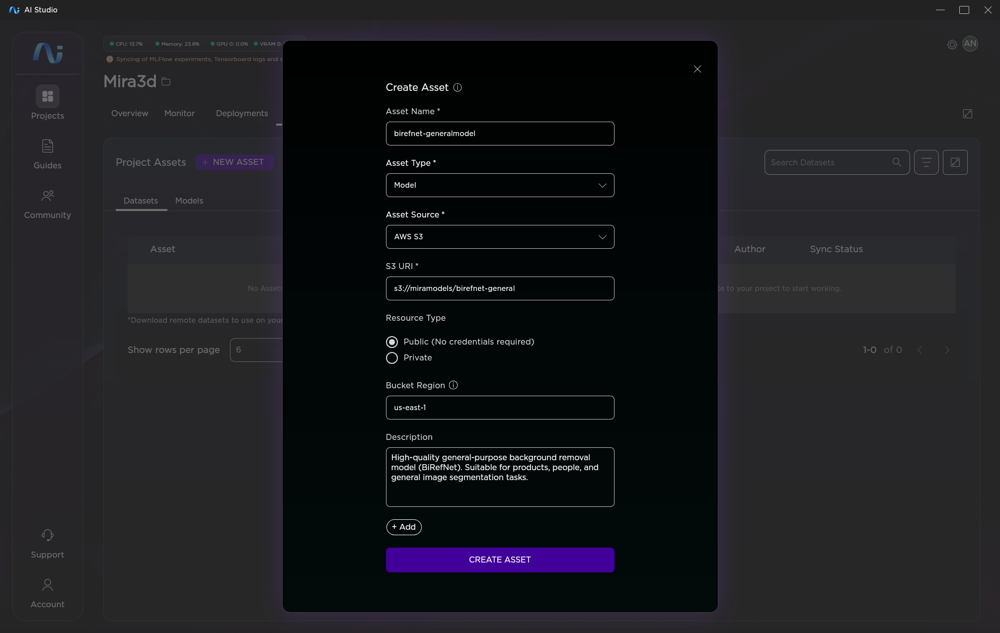
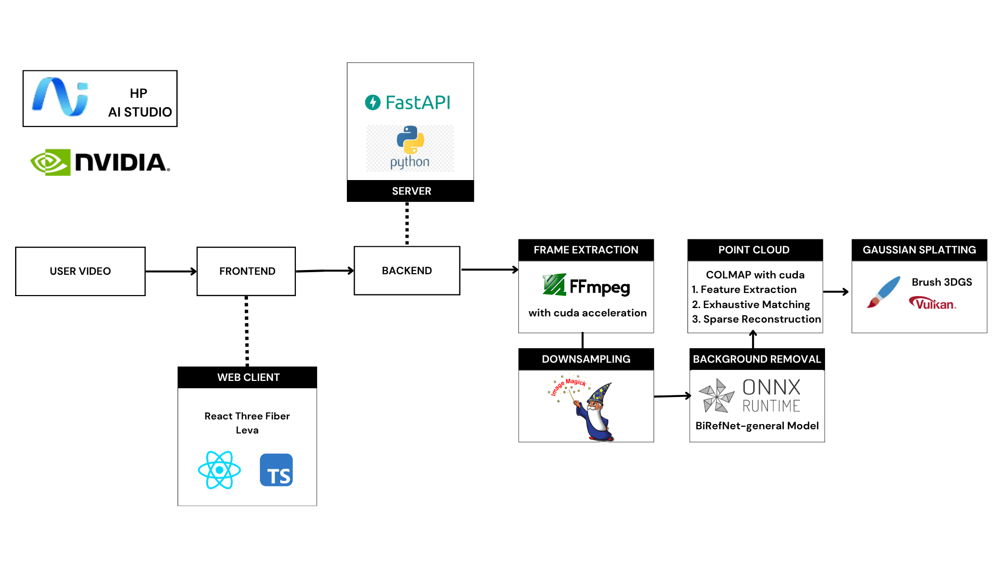
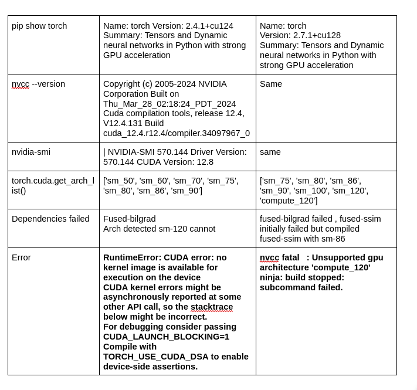

# Mira3D

**Mira3D** is a 3D reconstruction application that generates consistent, high-quality 3D point clouds from 2D videos using photogrammetry and Gaussian splatting techniques. Optimized for fast, secure, on-premises AI workflows using HP AI Studio and NVIDIA GPUs.






## ✨ Features

- **AI-Powered Background Removal**: Intelligent preprocessing using U2Net model for cleaner reconstructions
- **Video-to-3D Conversion**: Transform 2D videos into detailed 3D point clouds
- **Gaussian Splatting**: Advanced 3D reconstruction using state-of-the-art techniques
- **GPU Acceleration**: Optimized for NVIDIA GPUs with CUDA support
- **Real-time Processing**: Fast reconstruction pipeline for efficient workflows
- **Web Interface**: Interactive editor for viewing and exporting 3D models

##  Use Cases

Mira3D AI enhanced 3D reconstructions can be applied across multiple industries:

- 🏗️ **Architecture, Engineering & Construction (AEC)** – Room scans, building documentation, Heavy equipment without background
- 🏛️ **Cultural Heritage** – Scanning and preserving historical monuments
- 🛍️ **Retail** – 3D product models and virtual try-on experiences
- 📸 **Photography & Film** – Environment capture and visual effects
- 🏭 **Manufacturing** –  Quality control and part documentation with isolated object reconstruction


##  Quick Start

### Prerequisites

- HP AI Studio with Deep Learning Image
- NVIDIA GPU with CUDA support
- Ubuntu 22.04+ (recommended)

### Add the Birefnet Model

- Download the Birefnet.onnx via Models tab:

  * **Model Name**: `Birefnet-general`
  * **Model Source**: `AWS S3`
  * **S3 URI**: `s3://miramodels/birefnet-general`
  * **Bucket Region**: `us-east-1`




### Installation

1. **Clone the repository**
   ```bash
   git clone <repository-url>
   cd Mira3D
   ```

2. **Run the setup script**
   ```bash
   chmod +x setup.sh
   ./setup.sh
   ```
   
   This installs:
   - COLMAP with CUDA support
   - FFmpeg
   - ImageMagick (for image processing)
   - Brush rendering engine
   
   > **Note**: Installation may take several minutes depending on your hardware and internet connection.

3. **Verify installation**
   ```bash
   colmap -h
   ffmpeg -version
   ```

4. **Configure Vulkan (if needed)**
   
   Check if your GPU is properly detected:
   ```bash
   vulkaninfo | grep deviceName
   ```
   
   If you see `deviceName = llvmpipe (LLVM 15.0.7, 256 bits)` instead of your GPU, follow these steps:
   
   a. Copy the Vulkan ICD file from your host system:
   ```bash
   # On host machine your pc not hp ai studio
   ls /usr/share/vulkan/icd.d/
   cp /usr/share/vulkan/icd.d/nvidia_icd.json ~/Downloads/
   ```
   
   b. Drag and drop the file to your container, then run:
   ```bash
   sudo mkdir -p /usr/share/vulkan/icd.d
   sudo cp ~/nvidia_icd.json /usr/share/vulkan/icd.d/
   export VK_ICD_FILENAMES=/usr/share/vulkan/icd.d/nvidia_icd.json
   ```
   
   c. Verify GPU detection:
   ```bash
   vulkaninfo | grep deviceName
   ```
   You should see something like: `deviceName = NVIDIA GeForce RTX 5070`

5. **Export binaries for persistence**
   ```bash
   chmod +x export_binaries.sh
   ./export_binaries.sh
   ```
   This stores runtime dependencies as MLflow artifacts for HP AI Studio persistence.

### Running the Application

1. **(OPTIONAL) At this point you can generate splats locally .To understand how Gaussian Splatting works and test it out:**
   ```bash
   cd notebooks
   # Run gaussiansplatting.ipynb to understand the workflow
   ```

2. **To Test the main application with UI**
     ```bash
   cd notebooks
   # Run splatserver.ipynb to start FASTAPI server copy the url to be pasted in UI
   ```
3. **Configure the Frontend**
     ```bash
   cd frontend/src/components
   # Open chatbot.jsx and paste the backend URL where indicated.
   # From the root frontend directory, build and serve the app:
   npm install
   npm run build
   serve dist
   # npm install -g serve if needed
   ```

##  Usage

1. **Upload a video** through the web interface 
2. **Wait for processing** it takes atleast 5 to 10 minutes depending on your hardware and video meanwhile you can check
   ```bash
   watch -n 1 nvidia-smi
    # here different processes like ffmpeg , colmap , onnxruntime operations and brush can be seen using your gpu
   ```
3. **View and edit** your 3D model in the interactive editor
4. **Download your splat** from the chat response


##  MLFLOW

1. **To Launch the main application with MLFlow UI (Note: Vulkan's NVIDIA ICD is not mounting properly in the new MLflow container, causing the brush to fall back to CPU and fail.) **
   ```bash
   cd notebooks
   # Run 3dreconstructionpipeline.ipynb
   # Click on the generated URL to access the web interface
   #  
   ```

2. **Deploy to HP AI Studio**
   - Navigate to the Deployments page in HP AI Studio
   - Click on the provided URL to access the application
   - Try the demonstration at the top of the page


## My Development Environment

- **Platform**: HP AI Studio (Deep Learning Image)
- **OS**: Ubuntu 22.04.5 LTS
- **GPU**: NVIDIA RTX 5070
- **CUDA Version**: 12.8
- **Driver Version**: 570.144

## App Flow



##  Project Structure

```
Mira3D/
├── notebooks/
│   ├── gaussiansplatting.ipynb          # Testing pipeline
│   ├── splatserver.ipynb                # Run 3DGS FASTAPI server
│   └── 3dreconstructionpipeline.ipynb   # Main MLFLOW application
│   └── toolchain_mlflowartifact.ipynb   # To test out exported binaries with mlflow artifacts
│   └── toolcheckresponse.json           # MLFlow container bundled tool check response
│   └── tensorrttest.ipynb               # To convert the onnx model to trt and get faster inference
│   └── gsplatimplementation.ipynb       # gsplat incompatability issues
├── frontend                             # React three fiber UI
├── setup.sh                             # Installation script
├── export_binaries.sh                   # Binary export script
└── README.md                             
```

##  Troubleshooting

### Common Issues

**MLflow notebook workflow**: Sometimes the workflow stuck on preparing at this point you can run the gaussian splatting ipynb serve demo and put your splat there to test.

**GPU not detected for brush**: Follow the Vulkan configuration steps in the installation guide.

**COLMAP errors**: Ensure CUDA is properly installed and your GPU drivers are up to date. when you do colmap -h , you should built with cuda

**Permission errors**: Make sure all scripts have execute permissions:
```bash
chmod +x setup.sh export_binaries.sh
```

**Container persistence**: Use the export script to maintain dependencies across container restarts. I hope there is no use of this from the new update


## Gaussian Splatting Notes

To implement splatting, I initially started with [gsplat](https://github.com/ashawkey/gsplat) and the [official Gaussian Splatting implementation](https://github.com/graphdeco-inria/gaussian-splatting). However, I encountered compatibility issues with the **Blackwell architecture (sm_120)**.



After experimenting with a few alternatives, I settled on using [brush](https://github.com/ArthurBrussee/brush), which leverages **WGPU with Vulkan** for GPU rendering.

My Immediate goal is to resolve the compatibility issues and eventually migrate back to **gsplat**, which offers faster splatting using optimized CUDA and takes advantage of higher GPU VRAM availability.

[Demo](https://youtu.be/fwqmQgTEz2o?si=316RTDqUdh-jYkMO)

## References
https://colmap.github.io/
https://www.digitalocean.com/community/tutorials/photogrammetry-pipeline-on-gpu-droplet

https://github.com/graphdeco-inria/gaussian-splatting 

https://docs.gsplat.studio/main/ 
 
https://github.com/ZhengPeng7/BiRefNet